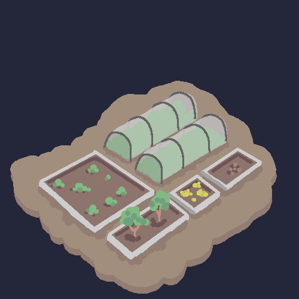

Reasoning: We pretend this little organisation we have is a 'Town' in a desolate and lonely desert. Why not tie ourselves deeper into our roots and (you know), make our websites based on said Town.

- [ ] Explain the 99 complex
    - [ ] as a whole
    - [ ] branches of the complex
- [ ] History of the 99 complex
- [ ] Drawing cause why not, eh?

Go around the Town enough, and you will notice that some people have a type of stall or shop set up. Loren has a garden and a coffee shop, Anonymous has a '''garden''', Pi-thagoras has a chicken pen, and so on so forth. I have a complex, the 99th complex.

This complex encompasses everything you will find here, the greenhouse and green-spaces where I grow my crops outside, the ramblings you'll find all around, and the xob comics.

the greenhouse:

