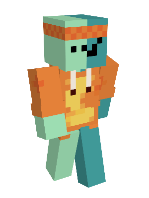

well, we are finally here. the death of ndcs, the very end. it was fun guys, it really was, but we are here now. what can we do about that? the sun is starting to set.

## what was ndcs?

ndcs was a little minecraft server with me and my friends. and it was extremely fun. we played with some mods like farmers delights, and we got to build a little town that i'm sure we're all a little proud of <3. 

  
(hey look its me)

## what happened in ndcs?

oh, well... a whole load of things

### 1: artifacts

at the very start[^1], i -- as admin -- spawn a bunch of overpowered stuff. the most influential are: eff 6 wooden pick, a backstabbing 255 netherite knife called "amongusus", and thorns 255 ed's head.

it was good times. and chaotic times as well. we don't talk about artifacts. 

### 2: explosions

i blew up ed's house... twice. in my defence, i have no defence. [he references it here](https://eddietheed.github.io/obsidiannotes-v.3/Development-Status/).

he later set up a tnt shop, which is probably not a great idea

### 3: anarchy for a moment

our democratic processes died for a second, and so we have a moment of anarchy[^3].

### 4: industrial revolution

there were two people who really put in the hours and turned the server into a thriving society[^2]. this was the industrial revolution, and we have lots and lots of autofarms, was able to wall off a massive region, and set up railway systems. 

we also became essentially immortal, but there was some tension, and so we had to draft up loads of agreements.

### 5: the end

and... suddenly it ended. just like that.

## ndcs 2?

we are planning on ndcs 2 when 1.20 if everyone isn't busy. i think it'll be fun, to do this again.

[^1]: and not many people who played ndcs actually know about this
[^2]: at the expense of me running the server at 9 fps.
[^3]: for a moment