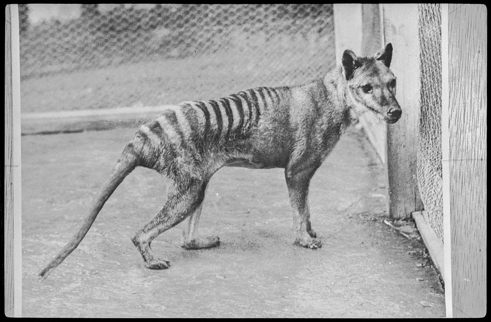

## ... about the Thylacine

The thylacine (AKA the Tasmanian tiger) is a now extinct native animal of Australia. It was driven to extinction as a result of the Western colonisation — due to the introduction of foreign animals, such as red foxes, feral cats and dogs, as well as being out-competed by the other native animals that were forced to migrate by the Western settlements.

The vilification of the thylacine also acted as a large contributor to the extinction of the thylacine. Although relatively harmless, it was represented as a dangerous beast that would wreck havoc on the livestock. As a result, white settlers were motivated to 

- Thylacine is an extinct native animal to Australia
- It was pushed to extinction as a result of:
    - Introduction of foreign animals, such as red foxes, feral cats, and dogs
    - Other native animals outcompeted the thylacine after being forced to migrate (by the Western settlements)
    - Vilification of the thylacine (e.g. dangerous beast, eater of cattle) → white settlers hunted thylacine, and the government set up bounty systems.
- Once extinct, thylacine became a national icon of Tasmania, and also of the larger Australia.
- Also, there were continued 'claimed' sightings → signal of hope of survival

---

- connection to nature
- white settlers, and lack of connection to nature

[ed commented that the main focus is the connection of nature then]: #

