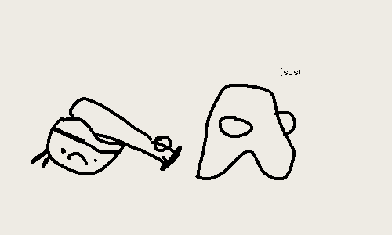

where exactly did [cover n check](coverCheck) fail? why did i stop using it? i will explain (briefly) (to you) why i think [cover and check flopped :-/](coverFlop).

## lack of specification

sure, anyone can make the cover n check notes that i described. it only brings up the question of... when to review notes? how often? in what manner? this lack of actual specification cause vagueness, and so i fell into the pit-fall of not doing it.

the "how often" question is especially important. in programs such as remnote, anki, quizlet, and friends, they tell you when to do it. with paper cover n check, you do it when you feel you need to do it... which is a terrible, *terrible*, idea. unless you find a system to do it, good luck :-/.

*take-away*: lack of specificity[^1] makes it hard to do stuff, so you end up not doing stuff.

## overwhelming

we make a lot of notes. so, i decided that it would be have less questions, more answers. this made a problem. lots of notes \* lots of stuff to answer = (lots of stuff to memorise)^2. this made it even harder to manage. and as we know, procrastination happens when you have an overwhelming amount of work, not when we have little. so i got bean'd by my own system.[^2]

*take-away*: lots \* lots = lots^2 = no work gets done

## do you look first?

a little ember of a question that ended up fire of alexandria-ing this project. "do you look first? or do you try first?" and goddamn i could not for the love of me find an answer. say for example, for chinese, do you try to write characters that you haven't memorised first, or do you look first then write. and what then? do you look at one word at a time? or do you look at like 10? the entire page? what exactly is manageable? if you look at one a time, what's the difference to the original method of writing each character 8 times?

*take-away*: questions, questions. management bonked me in the head.

[^3]

## greener pastures

i find greener pastures. i chase them.

*take-away (for you this time)*: i am extremely distractible ;-).

[^1]: honestly, this is unsurprising. of course if you don't have a plan, stuff doesn't work. that's like teaching a course without a curriculum. not a good plan. well... no plan < bad plan. (or is it?)
[^2]: half the time, the system i get from others end me. the other half, my own system end me. i'm not great at this.
[^3]: unironically one of the best amongi i have drawn.