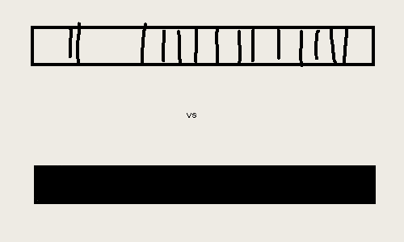

Atomic absorption spectroscopy (AAS) is a method that we use to identify the concentration of a certain element in a sample (usually a metallic element). Firstly, we must identify the element being analysed (the analyte) by using qualitative analysis, so that we can make a cathode lamp out of the same element as the analyte. We do this because there may exist many different elements in any given sample, and simply shining a white light into the sample makes it difficult to precisely identify the element.

The top spectrum shows the complete spectrum, 