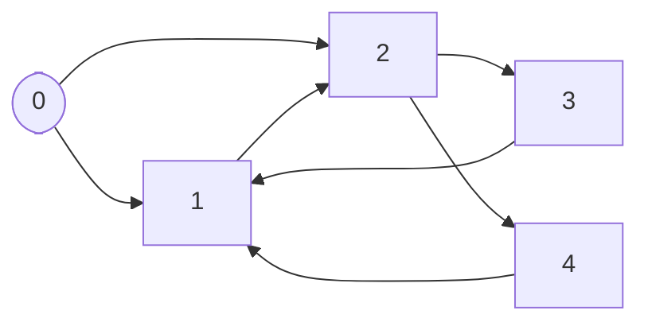
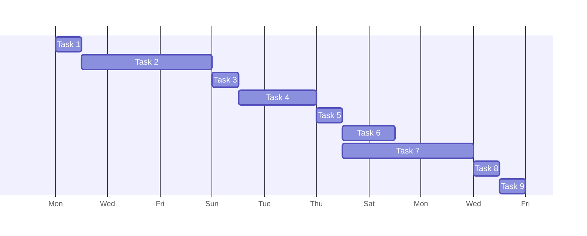
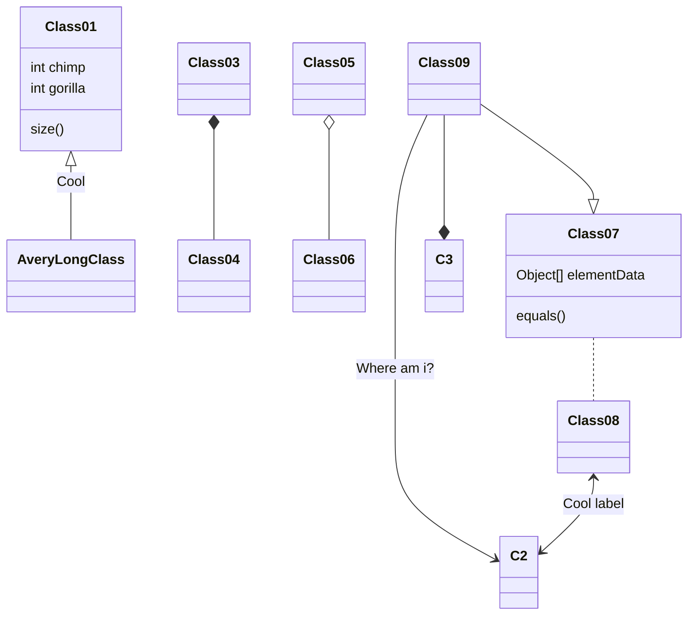
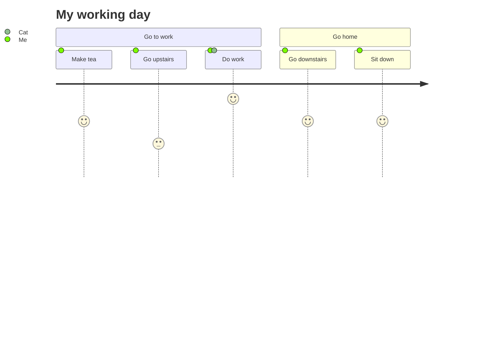

$$\begin{vmatrix}a & b\\
c & d
\end{vmatrix}=ad-bc$$

```mermaid
flowchart LR
id1([0]) --> 1 & 2 
2 --> 3 & 4 --> 1 --> 2
```

```mermaid
gantt 
axisFormat %a
Task 1: a1, 01, 1d
Task 2: a2, after a1, 5d
Task 3: a3, after a2, 1d
Task 4: a4, after a3, 3d
Task 5: a5, after a4, 1d
Task 6: a6, after a5, 2d
Task 7: a7, after a5, 5d
Task 8: a8, after a6 a7, 1d
Task 9: a9, after a8, 1d
```

```mermaid
classDiagram  
Class01 <|-- AveryLongClass : Cool  
Class03 *-- Class04  
Class05 o-- Class06  
Class07 .. Class08  
Class09 --> C2 : Where am i?  
Class09 --* C3  
Class09 --|> Class07  
Class07 : equals()  
Class07 : Object[] elementData  
Class01 : size()  
Class01 : int chimp  
Class01 : int gorilla  
Class08 <--> C2: Cool label
```
$$x^n + \frac{y}2^n = \sqrt(z^n)$$
$$\binom{n}{k}$$

```mermaid
journey
title My working day
section Go to work
Make tea: 5: Me
Go upstairs: 3: Me
Do work: 7: Me, Cat
section Go home
Go downstairs: 5: Me
Sit down: 5: Me
```
