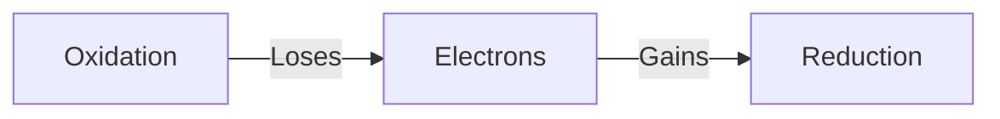

2022-03-31 13:24

Tags: #clumps 

Tags: [[10SCI]]

# 10SCI - Chemistry
## Chapter 1: Reactions
- **Neutralisation** reactions is when a *base* and an *acid* react to form a *neutral compound*.
	- Acid + Metal -> Salt + Hydrogen gas
	- Acid + Metal oxide -> Salt + Water
	- Acid + Metal hydroxide -> Salt + Water
	- Acid + Metal carbonate -> Salt + Water + Carbon dioxide
	- Acid + Metal hydrogen carbonate -> Salt + Water + Carbon dioxide
- **Combustion** reactions is the *exothermic oxidation* of a substance, a type of *redox* reaction
	- Hydrocarbon + Oxygen gas -> Water + Carbon dioxide
- **Displacement** reactions is when a *more reactive* element *displaces* a *less reactive* element in a compound, a type of *redox* reaction
	- A + BC -> B + AC
	- AB + CD -> AC + BD
- **Precipitation** reaction is the formation of a *solid* from *two solutions*.
	- AB(aq) + CD(aq) -> AC(aq) + BD(s)
- **Redox** reactions involves the *transfer* of *electrons*
- **Decomposition** reactions is the *breakdown* of a compound into simpler compounds
	- AB -> A + B
- **Synthesis** reactions is the *combination* of compounds into a greater compound
	- A + B -> AB
## Chapter 2: Ionics [^1] [^2]
- A **molecular equation** represents everything as a neutral compound.
- e.g. $AgNO_{3(aq)}+NaCl_{(aq)}→AgCl_{(s)}+NaNO_{3(aq)}$
- Some compounds **dissociate** in water, becoming ions. (***AQUEOUS***)
- A **complete ionic equation** rewrite soluble ionic compounds as dissociated ions.
- e.g. $Ag^+_{(aq)}+NO^-_{3(aq)}+Na^+_{(aq)}+Cl^−_{(aq)}→AgCl_{(s)}+Na^+_{(aq)}+NO^-_{3(aq)}$
- Ions that don't change are **spectator ions**.
- Remove spectator ions and you get **net ionic equations**.
- e.g. $Ag^+_{(aq)}+Cl^−_{(aq)}→AgCl_{(s)}$
- **e.g**. $H_2SO_{4(aq)}+2NaOH_{(aq)}→2H_2O_{(l)}+Na_2SO_{4(aq)}$
  $2H^+_{(aq)}+SO^{2-}_{4(aq)}+2Na^+_{(aq)}+2OH^-_{(aq)}→2H_2O_{(l)}+2Na^{2+}_{(aq)}+SO^{2-}_{4(aq)}$
  $2H^+_{(aq)}+2OH^-_{(aq)}→2H_2O_{(l)}$
  $H^+_{(aq)}+OH^-_{(aq)}→H_2O_{(l)}$
## Chapter 3: Redox [^2]
- **Oxidation Reduction**
- Transfer high energy electrons to low energy electrons.
- *Burning gasoline*
- Two parts:
	- **Reduction**: Gains electrons
	- **Oxidation**: Loses electrons

- Moves electrons from oxidized to reduced.
- $H_2+F_2→2HF$
	- Hydrogen was oxidized.
	- Fluorine was reduced.
- Half reactions:
	- $H_2→2H^++2e^-$ (Oxidation)
	- $F_2+2e^-→2F^-$ (Reduction)
- ***THE RULES*** of oxidation states
	- Free elements are zero
	- For ions, it is the charge. 
	- Oxygen is $-2$, unless in a peroxide, where it is $-1$
	- Hydrogen is $+1$ with nonmetals or $-1$ with metals
	- In neutral compounds the sum is $0$.
>*Free elements are free, but ions have a charge. 
Oxygen, it costs a 2, in pairs they will cost 1. 
Hydrogen with non-metals, a discount is added,
But with real metals, more expensive, price raised up by one..
Best of all are neutral compounds, many come for free.*
- $Mg_{(s)}+2HCl_{(aq)}→MgCl_{2(aq)}=H_{2(g)}$
	- Magnesium lost $2$ electrons, it was oxidized.
	- Hydrogen gained 2 electrons, it was reduced.
	- $Mg_{(s)}→MgCl_{2(aq)}+2e^-$
	- $2HCl_{(aq)}+2e^-→H_{2(aq)}$
- $HgCl_2+2Li→Hg+2LiCl$
	- Mercury gained $2$ electrons (reduced).
		- $Li→Li^++e^-$
	- Lithium lost $2$ electrons (oxidized).
		- $Hg^{2+}+2e^-→Hg$
- Transition metals have differing oxidation states.
- Oxidant reduces, reductant oxidize.
## Chapter 4: Moles
- $1$ **mole** is $6.02\times10^{23}$
- *$1$ mole of oxygen molecules is $6.02\times10^{23}$ oxygen molecules*
- **Stoichiometry** is the study of the quantitative aspects of chemical reactions.
- Mole *abbr.* **mol**
- There are $3.9$ mol in $1.8\times10^{24}$
- How to show molar mass: $M(x)=y$ 
- $M$ is **molar mass**
## Chapter 5: Stoich
1. Step 1:
	1. Mass to moles
	2. Moles to mass
	3. Mass to moles to mass
2. ![[Pasted image 20220418220652.png]]

---
# Questions

[^1]: [Molecular, complete ionic, and net ionic equations (article) | Khan Academy](https://www.khanacademy.org/science/ap-chemistry-beta/x2eef969c74e0d802:chemical-reactions/x2eef969c74e0d802:net-ionic-equations/a/complete-ionic-and-net-ionic-equations)
[^2]: Ms. Skirving