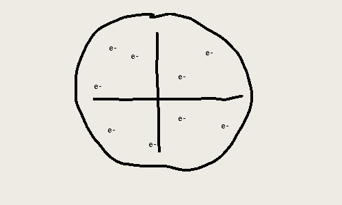
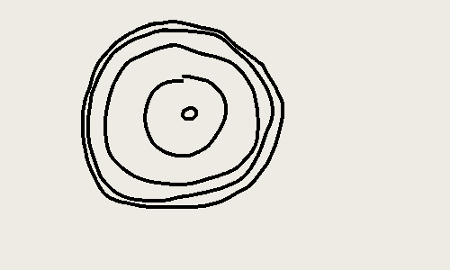

the people that contributed the most to the development of the atomic model are john dalton, jj thompson, ernest rutherford, niels bohr, and james chadwick.

## john dalton[^1]

john dalton is the person that came up with the idea of atoms as **indivisible particles that make up all the matter** in our universe. well, leucippus and democritus technically came before him, but the greek's ideas were based on guesses. john dalton actually based his (still slightly a guess) **theory on experiments**. he was the first person link atoms to actual experimental stuff. his thoughts laid the groundwork for... literally everyone else.

## jj thompson

jj thompson used **cathode ray tubes** in addition to magnets to find out that these rays were able to be manipulated by magnetic fields. cathode rays are invisible to the human eye, but it causes gases and certain solids (called phosphors) to glow. by only having a small slit in the cathode, he was able to only have a thin ray, which he could bend using magnets. by analysing the degree to which the ray bent, he was able to calculate the mass and charge of the ray.

by doing this he was able to predict that there existed a negatively charged particle in all atoms. but this particle would have to by smaller than an atom to be in an atom. this particle was sometimes able to move around freely like in the case of a cathode ray. however, atoms are neutrally charged, and so these negative particles must exist in a positively charged volume.

these negatively charged particles came to be known as electrons, and the model he used became the plum pudding model.

## ernest rutherford

ernest rutherford was the person who conducted the gold foil experiment. essentially, he set up an alpha-particle emitter to fire alpha particles at a very thin sheet of gold[^2] surrounded by a phosphor. according to thompson's model, as there were only electrons and the positive charge was distributed throughout the entire atom, there would be no deflection in the course of the alpha particles. these alpha particles would make a small flash of light when they hit the phosphor when seen under a microscope. however, some alpha particles experienced a significant deflection, sometimes even being reflected almost directly back!

through this observation, he concluded that, although atoms are majority empty due to the fact that most of the atoms passed straight through, there must be a small part within the centre of the atoms that contains all the positive charge and mass of the atom (as this positive charge is the only quality of the atom that would be able to deflect the atom). this is the nucleus that we now know. then he guessed that the electrons simply orbit this nucleus randomly.

this model is sometimes known as the planetary model.

## niels bohr

niels bohr was able to determine that electrons actually orbited in discrete energy levels around the nucleus. the changes between these energy levels grew increasingly small towards higher energy levels, eventually converging. this helped explain line spectra and the colour of flames to us humans.

this model is *also* sometimes called the planetary model.

## james chadwick

after rutherford's gold foil experiment, he went on to continue to experiment, and eventually found the proton through experimental means. however, the protons themselves could not account for the mass of an atom, and with electrons being negligible in mass, realised that there must be another particle that is neutrally charged but has a similar mass to that of a proton.

james chadwick was able to experimentally show that such a particle existed. this experiment was difficult in the fact that neutrons are not charged, so it was difficult to find such a particle.

[^1]: when? this applies to all of them
[^2]: i believe he used gold due to its incredible malleability.
