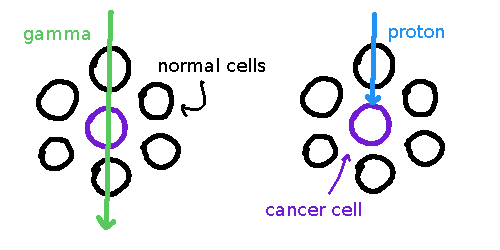

> Research and make notes on the following concepts:
> - The use of radioisotopes in diagnostic imaging including gamma cameras and PET scans
> - The use of radioisotopes in therapeutic treatments
> - The main ways in which radioisotopes are produced for use in medicine
> - Proton therapy and Neutron therapy
> - Radiation Dosimetry including Absorbed dose and Dose Equivalent.

Proton therapy's biggest benefit over X-rays → higher precision i.e. less radiation exposure to nearby cells[^2]. However, seems to require an understanding in how X-rays are used in radiotherapy, research first![^3]

[^2]: Sources don't really seem to specify, but apparently due to fact that X-rays pass through the tumour, continuing to do damage. Protons don't.

    

    Essentially, the protons can have an ending point specified. How it does this I don't know. Also, of course it isn't that specific (to degree of 1 cell). Might want to have a look at [this link](https://www.cancer.gov/news-events/cancer-currents-blog/2020/proton-therapy-safety-versus-traditional-radiation)

[^3]: Also, needs to be around the cyclotron.

Radiotherapy uses radiation e.g. X-rays for medical therapy e.g. killing cancer. Does so by directing high-doses of radiation at cancer cells, which damages the DNA (mutates base pairs, breaks the backbone, breaks hydrogen bonds), preventing reproduction/causing apoptosis. Indiscriminate, will harm normal cells.[^1]

[^1]: Note always for cancer, also for killing ... other tumours. Not very exciting.

PET is a type of scanning. Used w/ CT. The Wikipedia article is quite dandy. 