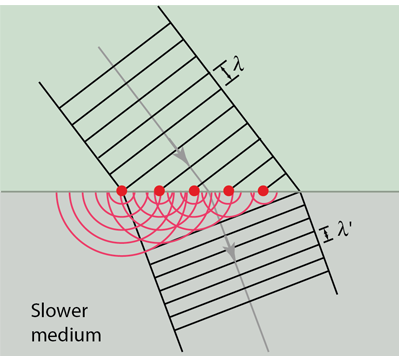

- Light (and other EMRs) act like waves
- Huygen's principle: every point in a wave creates wavelets. The new wave front is tangential to all these wavelets.
    - Correction: Every point on a wavefront creates smaller, spherical wavelets. The next wavefront is simply an addition of all of these wavelets.
    - Correction 2? The next wavefront is tangent to all the wavelets.
- Wavelets are semicircular. The radius is $s$, where $s=vt$.
- Seen in refraction, reflection, and diffraction
- Photo of Huygen's principle in action:  
    
- Diffraction happens when waves travel into a small opening (called an aperture). If the aperture is close to the wavelength, the aperture can be considered a new wave source.
    - Double slit experiment just does this for light.
- Correct for the wrong reason, apparently
- The diffraction of a wave depends on the size of the objects it is interacting with. For example, sound waves 'curve' around the doorway because the size of the doorway is in the same order of magnitude as the wavelength of the sound wave. On the other hand, light would not 'curve' around the door like this, because the wavelength of it is miniscule. However, if you have a tiny slit, it bending around can be observed.
    - Under normal conditions, light is more like a ray. It is only when we look at small stuff when we begin to see waves.
    - Reason why my shadow is blurry?
- When a wave changes mediums, the frequency stays the same but the velocity changes, and so the wavelength also changes. You can also see this using Huygen's principle, where the wavelet has a different velocity for a constant time, and so the distance until the next wavefront goes down.
