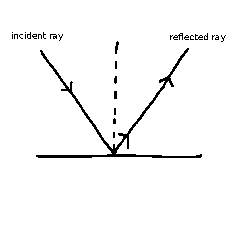
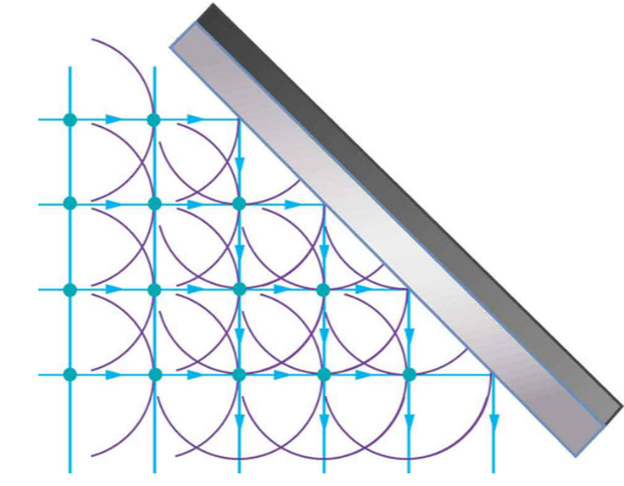
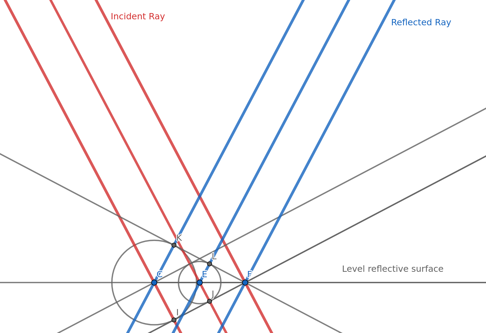

- Definition: At every point on a wavefront (of a wave), a semi-spherical wavelet in the direction of the wave. The next wavefront is perpendicular to all of the wavelets.
- Example: Use the same example in the [snell's law explainer](snellsExplainer.md)
- Explanation: The wavelets travel slower in a slower medium. This leads to a smaller distances between wavefronts and the ray of light bends towards the medium. Huygen's principle.
- Example 2: When a light wave hits a reflective level surface, then the light is the reflected off of the surface.

    

- Explanation 2: When a wavefront hits a surface, then you can imagine another wavelet produced on each point of impact. Again, you can take the **locus** of all of these points to get the reflected wavefront.

    

- Key point: Using Huygen's principle, we are able to predict how waves interact with objects, whether that be through refraction, reflection, or diffraction. For these interactions, we can assume that a secondary wavelet is formed at the point of 'impact'. Using this, we are able to predict how a wave may behave. With refraction, the change in the speed of the wave allows us to calculate which way a wave will bend when entering a new medium. With reflection, we can predict how it reflects (abides by the law of reflection).

    

    (Wavefronts substituted for rays of light in order bring focus to the reflection)