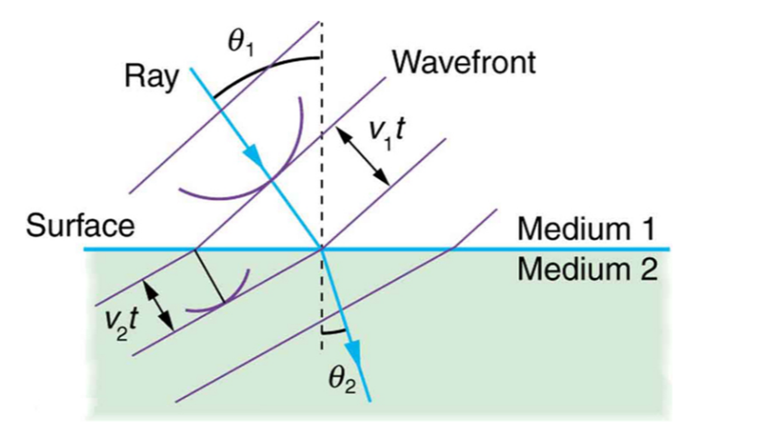

- Definition: $\frac{\sin \theta_{1}}{\sin \theta_{2}}=\frac{n_{2}}{n_{1}}=\frac{v_{1}}{v_{2}}$, where $\theta$ is the angle of incidence/refraction, $n$ is the refractive index, and $v$ is the velocity of the wave.
- Example 1: If you shine a ray of light into a glass prism, then you will see the ray of light 'bend', and change its direction (when it exits, it will bend again). Photo provided (hello Dr Waters, please ignore the strangeness of this image):

    

- Explanation: When a wave enters a slower medium, the wave slows down. Under Huygen's principle, the wavelets produced at each point of the wavefront also slow down, which leads to a smaller difference between the wavefront. However, as shown in the diagram, this slowing will also lead to a change in the direction. Slower mediums will change the angle of refraction to be closer to the medium.

    

- Key points: If a wave enters a slower medium, then the wave will bend towards the medium. i.e. the angle of refraction is smaller than the angle of incidence. On the other hand, if a wave enters a faster medium, then the wave will bend towards the medium, and hence the angle of refraction will be greater. However, the speed of the medium depends on the type of wave. For example, light travels fastest in a vacuum (or shan-mei apparently), and then will slow down in any other medium that is more dense, i.e. water. On the other hand, sound travels fastest in a very dense medium, such as steel, whereas it travels very slowly in air in comparison. Doesn't travel in vacuum at all. **Please note that the refractive index only applies to light.**