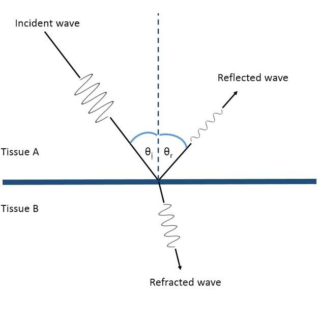

- Example: You go to a doctor. Maybe you're pregnant or some part of your body is not working properly. The doctor puts a probe onto your skin, and then makes an image of your internal structures (sonogram). They then use the sonogram to see what is up with you.
- Explanation: The probe used in ultrasound imaging produces high frequency sound waves --- above 20 Hz and usually between 2 MHz to 18 MHz. The high frequency sound waves emitted by the probe propagates through the human body, and when encountering a change in media, some of the energy is reflected back towards the probe (an echo); the rest will refract. This probe also picks up reflected sound waves through the piezoelectric effect i.e. When a mechanical stress (in this case sound) is exerted onto certain materials such as crystals, electricity builds up in the material.

    Media such as blood and other fluids reflect less energy, and so it appears darker in the sonogram. On the other hand, bones and other solid tissue reflect more energy, so they appear lighter.

    

- Process:

    1. Probes transmit high-frequency sound wave into the body.
    1. Sound waves travels through body until it hits a media boundary.
    1. Some of the energy is reflected back to the probe.
    1. These waves are picked up by the probe, and converted to electricity using the piezoelectric effect.
    1. This is inputted into a computer which uses the time taken, speed of medium, and the strength of reflected wave to calculate distance.
    1. It generates an image based of the data collected.