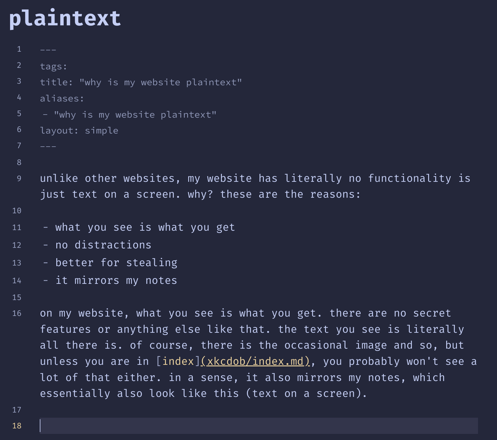

unlike other websites, my website has literally no functionality is just text on a screen. why? these are the reasons:

- what you see is what you get
- no distractions
- better for stealing
- it mirrors my notes
- faster

## wysiwyg

on my website, what you see is what you get. there are no secret features or anything else like that. the text you see is literally all there is. of course, there is the occasional image and so, but unless you are in [xob](xob.md), you probably won't see a lot of that either. in a sense, it also mirrors my notes, which essentially also look like this (text on a screen). look here:

so yeah, i make notes like this, and it is very close to the experience that you get when you go onto my website.

## distractionless

there are no fancy buttons and no cool features on this website. it is literally a notes website. and although i might change that for specific pages, the general idea will stay the same. if you want stuff, come in and go out once you find it. if you want to explore, get lost. the important stuff is the content, not all the crap around it.

## better for stealing

you can go onto my website, press `ctrl+a`, `ctrl+c`, then go onto word or something, and `ctrl+v` to literally just copy all the contents of the page in the way in looks. it is very easy to steal. you can also print the page, and it is readable. the reason is that i don't want to lock you into using my website, that is not my goal. you can freely walk in, copy what you need, and view it on the medium that you like, i don't care.

## faster

using less css and less js and less images is always faster.

oh yeah and also, screw you too jerry.