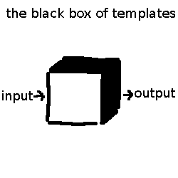

templates are a little bit like functions. you put an input into a little black box, and you get a result. then you use that result. however, just like function, templates have the little problem called 'i have no clue what goes on inside that box'.

templates are also rather robust, but also inflexible. They work well if you use it exactly the way it was designed to be used, however, if you deviate a little from that, it kind of breaks. Also, due to it's inflexibility, editing it can be difficult, which can be seen as Quartz, as well as with when Shan-mei used [Primer](https://pages-themes.github.io/primer/) and Dasindu using [Tactile](https://pages-themes.github.io/tactile/) (the last two was very difficult to add custom HTML and CSS, whilst Quartz works, except not everyone 'gets' it).

This is the problem with templates. It's useful, but does not work when it should.
