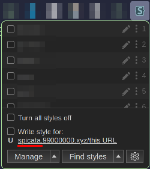
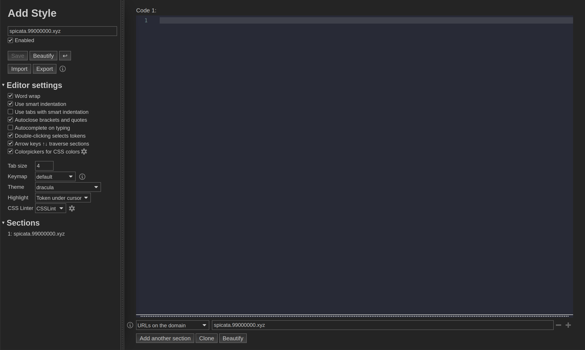

First, install the Stylus browser extension ([Chrome/Edge](https://chrome.google.com/webstore/detail/stylus/clngdbkpkpeebahjckkjfobafhncgmne) or [Firefox](https://addons.mozilla.org/en-US/firefox/addon/styl-us/)). A little icon should appear in your extension bar (see attached):

Then, when you are on my website, press on the part underlined here:

This should open a page that looks like this. On here, you can copy paste the CSS snippets from my website in order to change how it looks. Press `ctrl+s` to save, and toggle it by clicking the little icon on your bar.

