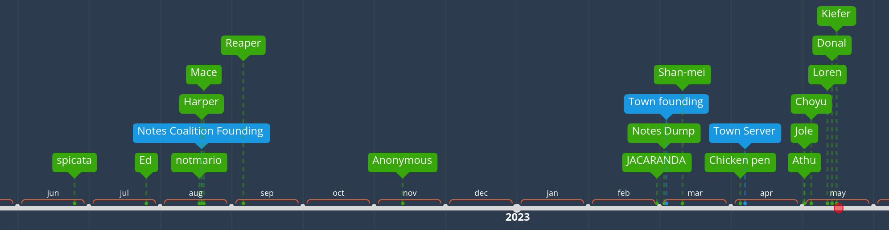

25th of June, 2022, was the day that my first website was made.

26th of July, 2022, the earliest date where Ed referenced his website. Possibly made earlier.

18th of August, 2022, when notmario's notes were made. Again, probably earlier.

19th of August, 2022. When the Notes Coalition was made, and also the earliest recorded time for Harper's notes website.

20th of August, 2022. The date that Mace was added to the Notes Coalition, though it was probably earlier when he made it.

6th of September, 2022. The date when Reaper's notes were first made.

13th of November, 2022, the day when Anonymous was added to the Notes Coalition, although his website was probably made earlier.

28th of February, 2023, the first commit by Thomas on Jacaranda.

3rd of March, 2023. The start of Jonathan's notes dump.

4th of March, 2023. When the town became a DM group.

11th of March, 2023, when Shan-mei's notes were made.

5th of April, 2023. The beginning of the chicken pen.

7th of April, 2023, when the town became a server.

2nd of May, 2023. Jole's notes were made, and also when Athu Sathe made his website.

5th of May, 2023, the beginning of Choyu's website.

12th of May, 2023. When Carambola's notes went public.

14th of May, 2023. Donal joins the town

16th of May, 2023. Kiefer joins the town.

